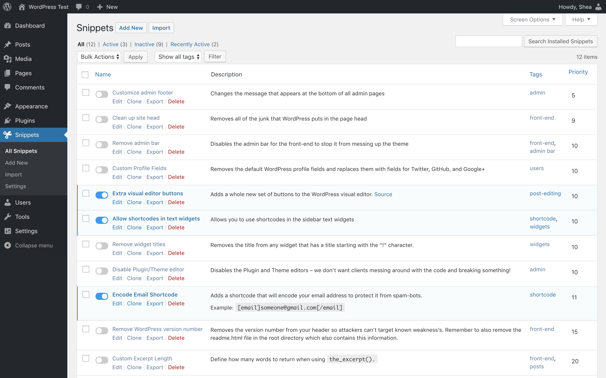
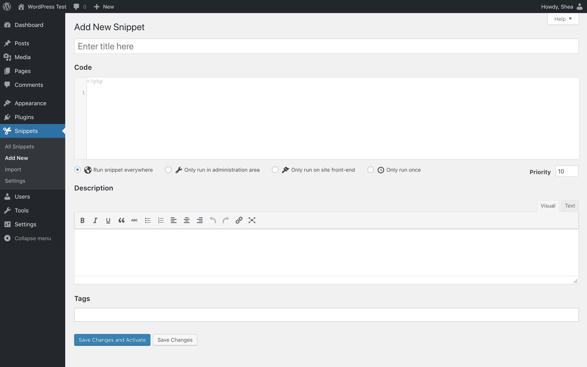
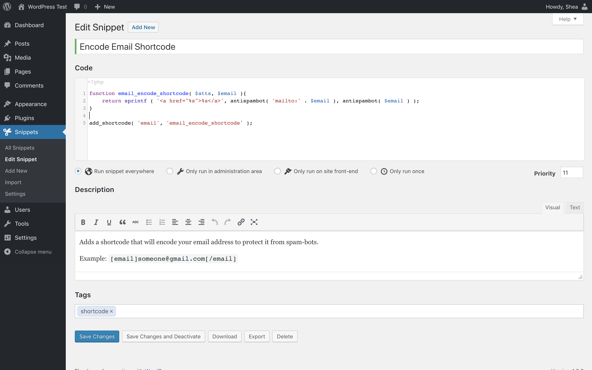
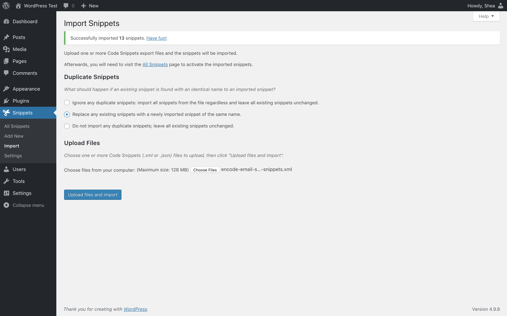

# Code Snippets 

* __Requires at least:__ [WordPress 3.3](http://wordpress.org/download/) or later
* __Tested up to:__ WordPress 3.0
* __Stable version:__ [1.9.1.1](http://downloads.wordpress.org/plugin/code-snippets.latest-stable.zip)
* __License:__ [MIT](license.txt)

An easy, clean and simple way to add code snippets to your site.

## Description

**Code Snippets** is an easy, clean and simple way to add code snippets to your site. No need to edit to your theme's `functions.php` file again!

A snippet is a small chunk of PHP code that you can use to extend the functionality of a WordPress-powered website; essentially a mini-plugin with a *lot* less load on your site.
Most snippet-hosting sites tell you to add snippet code to your active theme's `functions.php` file, which can get rather long and messy after a while.
Code Snippets changes that by providing a GUI interface for adding snippets and **actually running them on your site** as if they were in your theme's `functions.php` file.

You can use a graphical interface, similar to the Plugins menu, to manage, activate, deactivate, edit and delete your snippets. Easily organize your snippets by adding a name and description using the visual editor. Code Snippets includes built-in syntax highlighting and other features to help you write your code. Snippets can be exported for transfer to another side, either in XML for later importing by the Code Snippets plugin, or in PHP for creating your own plugin or theme.

Although Code Snippets is designed to be easy-to-use and its interface looks, feels and acts as if it was a native part of WordPress, each screen includes a help tab, just in case you get stuck.

### Translations

Code Snippets can be used in these different languages thanks to the following translators:

* German - [David Decker](http://deckerweb.de)
* French - [oWEB](http://office-web.net)
* Japanese - [mt8](http://mt8.biz/)
* Serbo-Croatian translation [Borisa Djuraskovic from Web Hosting Hub]()
* Chinese - [Jincheng Shan](http://shanjincheng.com)
* Russian - [Alexander Samsonov](http://www.wordpressplugins.ru/administration/code-snippets.html)
* Slovak - [Ján Fajčák](http://wp.sk)

## Other Notes

Further information, documentation and updates are available on the [plugin homepage](http://code-snippets.bungeshea.com).

If you have any feedback, issues, or suggestions for improvements please leave a topic in the [Support Forum][support]. If you like the plugin, or it is useful to you in any way, please review it on [WordPress.org][review]

Snippets are stored in the `wp_snippets` table in the WordPress database (the table name may differ depending on what your table prefix is set to).
Code Snippets will automatically clean up its data when deleted through the WordPress dashboard.

## Installation

### Automatic installation

1. Log into your WordPress admin
2. Click __Plugins__
3. Click __Add New__
4. Search for __Code Snippets__
5. Click __Install Now__ under "Code Snippets"
6. Activate the plugin

### Manual installation

1. Download the plugin
2. Extract the contents of the zip file
3. Upload the contents of the zip file to the `wp-content/plugins/` folder of your WordPress installation
4. Activate the Code Snippets plugin from 'Plugins' page.

**Network Activating** Code Snippets through the Network Dashboard will enable a special interface for running snippets across the entire network.

## Frequently Asked Questions

Further documentation is available on the [plugin website](http://code-snippets.bungeshea.com/docs/).

### Do I need to include the `<?php`, `<?` or `?>` tags in my snippet?
No, just copy all the content inside those tags. If you accidentally forget (or just like being lazy), the tags will be stripped from the beginning and end of the snippet when you save it. You can, however, use those tags *inside* your snippets to start and end HTML sections.

### Is there a way to add a snippet but not run it right away?
Yes. Just add it but do not activate it yet.

### How can I insert my snippet into the post text editor?
Snippets that you add to this plugin are not meant to be inserted into the text editor. Instead, they are run on your site just as if they were added to your functions.php file.

### Help! I just activated a snippet, and my whole site broke!
You can try activating 'safe mode'. All snippets will not execute while safe mode is active, allowing you to access your site and deactivate the snippet that is causing the error. To activate safe mode, add the following line to your wp-config.php file, just before the line that reads `/* That's all, stop editing! Happy blogging. */`:

    define('CODE_SNIPPETS_SAFE_MODE', true);

To turn safe mode off, either [comment out](http://php.net/manual/language.basic-syntax.comments.php) this line or delete it.

### What do I use to write my snippets?
The [CodeMirror](http://codemirror.net) source-code editor will add line numbers, syntax highlighting, bracket matching, search, tabulate and other cool features to the code editor.

### Can I preform search and replace commands in the code editor?

* __Ctrl-F / Cmd-F__ : Start searching
* __Ctrl-G / Cmd-G__ : Find next
* __Shift-Ctrl-G / Shift-Cmd-G__ : Find previous
* __Shift-Ctrl-F / Cmd-Option-F__ : Replace
* __Shift-Ctrl-R / Shift-Cmd-Option-F__ : Replace all

### Will I lose my snippets if I change the theme or upgrade WordPress?
No, the snippets are stored in the WordPress database and are independent of the theme and unaffected by WordPress upgrades.

### Can the plugin be completely uninstalled?
Yes, when you delete Code Snippets using the 'Plugins' menu in WordPress it will clean up the database table and a few other bits of data. Be careful not to remove Code Snippets by deleting it from the Plugins menu unless you want this to happen.

### Can I copy any snippets I've created to another WordPress site?
Yes! You can individually export a single snippet using the link below the snippet name on the 'Manage Snippets' page or bulk export multiple snippets using the 'Bulk Actions' feature. Snippets can later be imported using the 'Import Snippets' page by uploading the export file.

### Can I export my snippets to PHP for a site where I'm not using the Code Snippets plugin?
Yes. Click the checkboxes next to the snippets you want to export, and then choose **Export to PHP** from the Bulk Actions menu and click Apply. The generated PHP file will contain the exported snippets' code, as well as their name and description in comments.

### Can I run network-wide snippets on a multisite installation?
You can run snippets across an entire multisite network by **Network Activating** Code Snippets through the Network Dashboard. You can also activate Code Snippets just on the main site, and then individually on other sites of your choice.

### I need help with Code Snippets
You can get help with Code Snippets either on the [WordPress Support Forums][support], on [GithHub][issues], or on [WordPress Answers](http://wordpress.stackexchange.com).

### I have an idea for a cool feature for Code Snippets!
That's great! Let me know by starting (or adding to) a topic in the [Support Forums][support] or open an issue on [GitHub][issues].

### I want to contribute to and help develop the Code Snippets plugin!
That's fantastic! Join me on [GitHub](http://github.com/bungeshea/code-snippets), and also be sure to check out the [development page](http://code-snippets.bungeshea.com/development/) on the [project website](http://code-snippets.bungeshea.com).

## Screenshots

### Managing existing snippets

### Adding a new snippet

### Editing a snippet

### Importing snippets from an XML file

  [support]: http://wordpress.org/support/plugin/code-snippets/
  [github]: https://github.com/bungeshea/code-snippets
  [homepage]: http://code-snippets.bungeshea.com
  [issues]: https://github.com/bungeshea/code-snippets/issues
  [review]: http://wordpress.org/support/view/plugin-reviews/code-snippets
